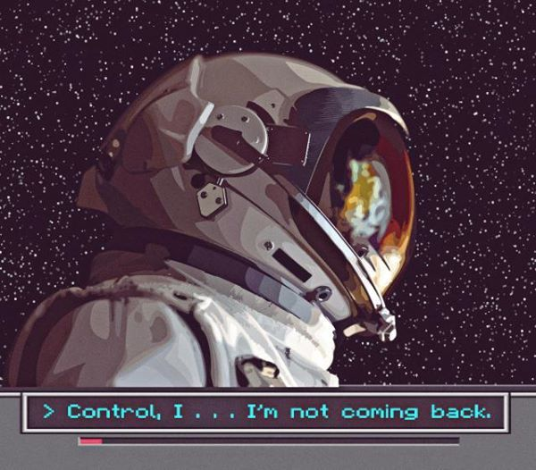

 

<table align="center">
<tr>
<td width="50%" align="center">

</td>
<td width="50%" align="center">

<samp>

> no signal received.
> transmission unstable.

</samp>

</td>
</tr>
</table>

 

   <samp>
      language:
      c#
      java
      python
       
      database:
      sql-server
      sqllite
       
       
    </samp>

  

</samp>

