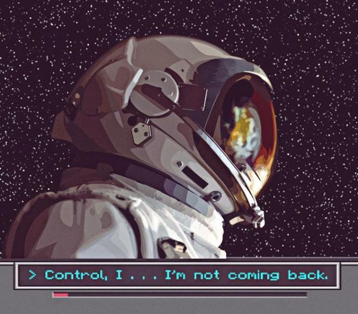

<!-- Fastfetch Terminal Card -->
<table border="0" style="border-collapse: collapse; background-color: transparent;">
<tr>
<td align="center" valign="middle" style="padding-right: 25px;">
 
</td>
<td align="left" valign="middle">
<pre style="font-family: monospace; font-size: 13px; line-height: 1.4; margin: 0;">
<b>awais@github</b>
------------
<b>Degree   :</b> Software Engineering (BS @ FAST)
<b>Location :</b> Karachi, Pakistan
<b>Honors   :</b> 5x Dean's List Scholar
<b>Stack    :</b> React Native, .NET, Spring Boot
<b>Languages:</b> C#, Java, Python, Lua, React
<b>Tools    :</b> GitHub, Power Apps, Web Dev
</pre>
</td>
</tr>
</table>

 

<!-- Structured System Specs -->
<table width="80%" border="0" style="border-collapse: collapse;">
<tr>
<td align="left">
<pre style="font-family: monospace; font-size: 13px; line-height: 1.5;">
<b>Core Competencies</b>
 ├─ <b>Languages</b> : C#, Java, Python, Lua, React
 ├─ <b>App Dev</b>   : React Native, Desktop & Mobile Apps, Web Dev
 └─ <b>Backend</b>   : REST APIs, Database-Driven Solutions, Power Apps

  

<b>Featured Projects</b>
 ├─ <b>3D Model Viewer</b>   : .NET web server project to showcase 3D models
 ├─ <b>Digital Store Sim</b> : Java Spring Boot store w/ cart & payment
 └─ <b>Pokedex Simulator</b> : React Native app w/ Pokemon battles

<b>Experience</b>
 ├─ <b>Mobile Developer</b>   @ Airi Dev (04/2026 - 06/2026)
 └─ <b>Game Design Intern</b> @ Mindstorm Studios (05/2023 - 07/2023)
</pre>
</td>
</tr>
</table>

 

<!-- Badges / Links Footer -->

  
  &nbsp;
  

